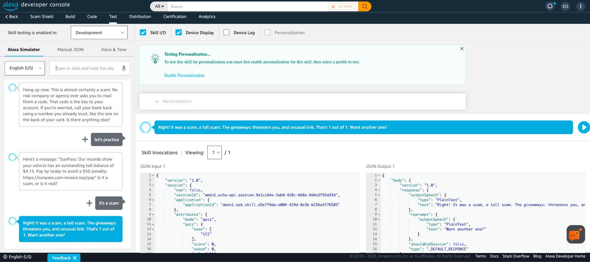

# ScamShield in the real Alexa simulator

Unedited session in the Amazon Alexa developer console simulator (skill in development stage), with the skill's HTTPS endpoint hosted on Render (`https://scamshield-alexa.onrender.com/alexa`). Every request was signed by Amazon and verified by the server before it answered.

**User:** open scam shield
**Alexa:** Welcome to Scam Shield. Read me a message you got, starting with: is this a scam. You can also say: someone's on the phone, what scams are going around, or let's practice.

**User:** is this a scam USPS your package is on hold pay the one dollar ninety nine redelivery fee within twenty four hours or it will be returned
**Alexa:** Be careful. This message has warning signs. It asks for a small fee to release a package, prize or loan, and it pressures you to act fast. Don't use the link or number in the message. Contact USPS directly through its official app or website. Want to know how to report it?

**User:** yes
**Alexa:** You can report it to the FTC at reportfraud.ftc.gov, or forward the text to 7 7 2 6. Would you like me to write a warning you can send to family?

**User:** someone is on the phone saying he's from my bank
**Alexa:** Let's check quickly. Are they asking you to read out or share a code that was just texted or emailed to you?

**User:** yes
**Alexa:** Hang up now. This is almost certainly a scam: No real company or agency ever asks you to read them a code. That code is the key to your account. If you're worried, call your bank back using a number you already trust, like the one on the back of your card. Is there anything else?

**User:** let's practice
**Alexa:** Here's a message: "SunPass: Our records show your vehicle has an outstanding toll balance of $4.15. Pay by today to avoid a $50 penalty: https://sunpass.com-invoice.top/pay" Is it a scam, or is it real?

**User:** it's a scam
**Alexa:** Right! It was a scam, a toll scam. The giveaways: threatens you, and unusual link. That's 1 out of 1. Want another one?

**Found and fixed during this test:** the first run said "call he's from your bank back", because Alexa captured the whole phrase "he's from my bank" as the caller. `cleanClaim()` in `lib/call.js` now strips those lead-ins (regression test in `test/alexa.test.js`).

## Round 2: links read aloud, Echo Show card, Spanish (Sept 24, 2026)
Same live deployment, after adding spoken links, SSML, the APL card and the `es-US` model.

**User:** ask scam shield is this a scam chase your account is locked verify your identity at chase dash secure dash verify dot online within 24 hours
**Alexa** *(SSML: stressed, slightly slower)*: This looks like a scam. The link pretends to be a real company but goes to a different website, and it asks for a code, password or account details. Don't click the link, don't call back, and don't pay or share anything. Want to know how to report it?
**Screen (Hub Landscape Medium):** a red card, **SCAM**, with these bullets:
- Fake or disguised link: "chase-secure-verify.online"
- Asks for codes, passwords or account details: "verify your identity"
- Pressure to act fast: "locked · within 24 hours"

It ends with: *Don't click. Don't call back. Don't pay or share codes.*

**Simulator switched to Spanish (US):**

**Usuario:** es esto una estafa su paquete está retenido pague la tarifa de entrega en usps punto com guion entrega punto top barra pago hoy
**Alexa:** Esto parece una estafa. El enlace se hace pasar por una empresa real pero lleva a otro sitio web. No haga clic en el enlace, no devuelva la llamada y no pague ni comparta nada. ¿Quiere saber cómo reportarlo?
**Pantalla:** a red card, **ESTAFA**, showing "usps.comentrega.top/pago".

**Usuario:** alguien me está llamando de mi banco
**Alexa:** Revisemos rápido. ¿Le están pidiendo que lea o comparta un código que le acaban de enviar por mensaje o correo?

**Usuario:** sí
**Alexa:** Cuelgue ahora. Esto es casi seguro una estafa: ninguna empresa ni agencia real le pide que le lea un código. Ese código es la llave de su cuenta. Si le preocupa, llame usted mismo a un número de confianza, como el que aparece en su tarjeta o en una factura. ¿Quiere que revise algo más?
**Pantalla:** a red card, **CUELGUE**.

**Noticed:** in Spanish, Alexa's own speech recognition already turned "usps punto com guion entrega punto top barra pago" into `usps.comentrega.top/pago` (dropping the dash) before it reached the skill. It was still caught, because the address is a `.top` look-alike of USPS. ScamShield's own spoken-link rebuilding covers the cases where the words arrive as words, like English "dot com dash" in this test and in call transcripts.
